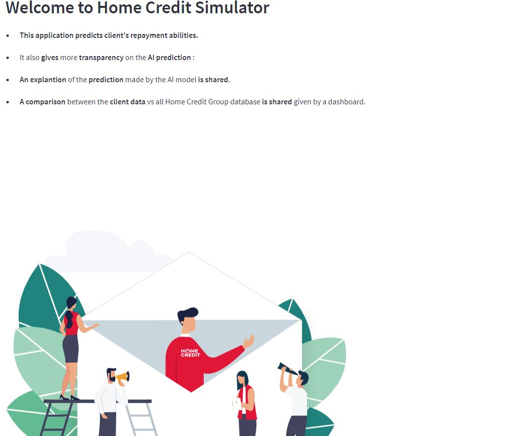
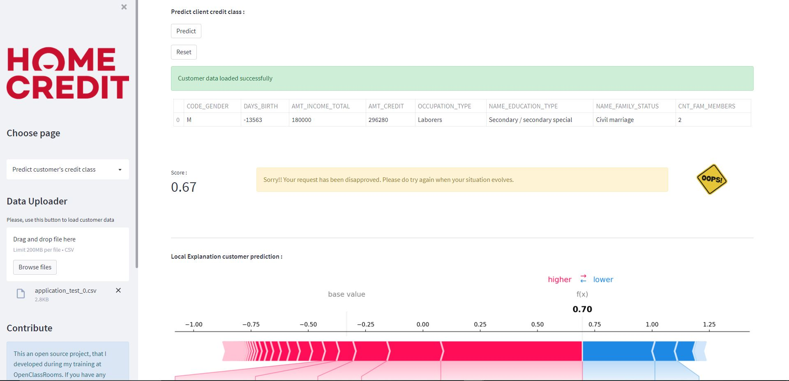
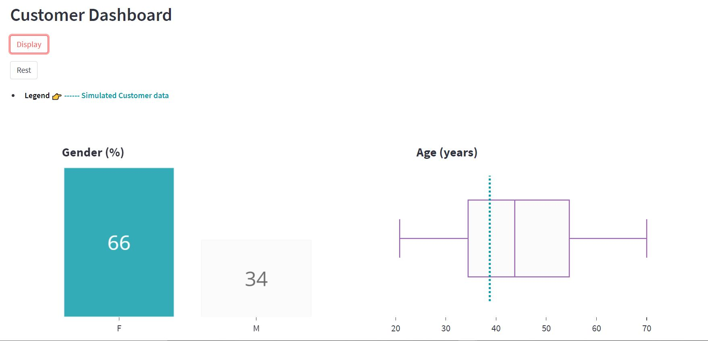

# Home_Credit_FrontEnd

Home_Credit_FrontEnd Is a multi-page streamlit app developed as an OpenClassRooms project.

The application helps the Home Credit bank agents to identify a risk related to a customer home credit loan.

Please feel free to reach me if you need the username and the password.

- Web app: https://oc-project-07-app.herokuapp.com/

- Data link: https://www.kaggle.com/c/home-credit-default-risk/data

The application has 3 pages :

## Page : Application presentation

This page contains a quick explanation of why this application was created.

## Page : Predict customer's credit class

This page contains :
- The customer raw data used for prediction.
- Customer credit prediction (class).
- Local model prediction explanation using shap package.
- Global model prediction explanation using shap package.

## Page : Dashboard

This page contains a dashboard that compare customer data vs client database.

## EDA and API github links

There are two more GitHub repositories linked to the same project :

- EDA notebook : https://github.com/mohamedsidina/Home_Credit_EDA
- API : https://github.com/mohamedsidina/Home_Credit_BackEnd